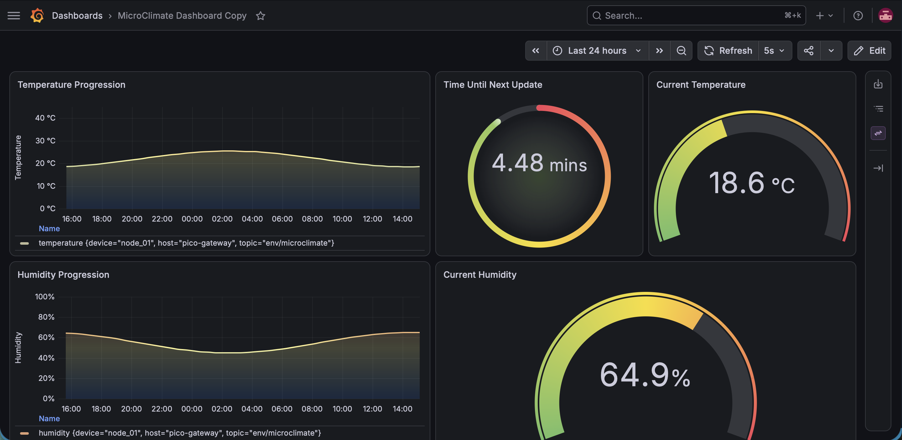

# MicroClimate Logger: Resilient Edge IoT Monitor



MicroClimate Logger is a compact, battery-powered environmental monitoring system built for edge IoT deployments. Utilizing a Raspberry Pi Pico W, a DHT22 sensor, and an SPI microSD module, the system collects local climate data, streams it via MQTT, and stores it in a containerized time-series backend (InfluxDB) for visualization in Grafana.

## Project Gallery


This project was specifically designed to tackle common edge-computing challenges, including intermittent network connectivity, router-level protocol blocking, and hardware power constraints.

## Key Engineering Features

* **Store-and-Forward Telemetry (Offline Resilience):** Built to survive network drops. If the MQTT broker is unreachable, the Pico falls back to local microSD storage. Upon reconnection, the firmware parses the offline CSV cache, reconstructs the JSON payloads, and flushes them to the server so no historical data is lost.
* **Robust HTTP Time Synchronization:** Public NTP servers (UDP Port 123) are frequently blocked by enterprise and home Wi-Fi routers. This firmware bypasses UDP restrictions entirely by fetching true UTC epoch time via an HTTP GET request to WorldTimeAPI, ensuring 100% accurate time-series ingestion into InfluxDB even after local network interruptions.
* **Power Optimization:** The device operates on a deep-sleep loop, waking only to sample data, execute the Wi-Fi/MQTT connection phase, and immediately power down the radio to maximize battery life in remote locations.

## Architecture & Data Flow


1. **Edge Device (Pico W):** Samples temperature/humidity, fetches real-world time, and packages data into a JSON payload.
2. **Transport Layer (MQTT):** Publishes to the `env/microclimate` topic.
3. **Ingestion & Storage (Telegraf + InfluxDB):** Telegraf parses the JSON timestamp (`timestamp_ms`) to correctly backdate any cached/offline readings before writing to InfluxDB.
4. **Visualization (Grafana):** Connects to the InfluxDB bucket to plot historical trends.

## Hardware Requirements

* Raspberry Pi Pico W
* DHT22 Temperature & Humidity Sensor
* MicroSD Card Module (SPI)
* External Battery Pack / Power Source

## Repository Structure

```text
├── firmware/                       # C++ Firmware for Pico W
│   ├── MicroClimateLogger.ino      # Main device logic
│   └── secrets_template.h          # Template for Wi-Fi/MQTT credentials
├── backend/                        # Dockerized Time-Series Stack
│   ├── docker-compose.yml          # Container orchestration
│   ├── mosquitto/                  # MQTT broker configuration
│   ├── telegraf/                   # Telegraf MQTT-to-InfluxDB bridge
│   └── grafana/                    # Grafana dashboards & provisioning
└── docs/                           # Images and architecture diagrams
```
## Getting Started

### 1. Edge Device Setup

1. Rename `firmware/secrets_template.h` to `firmware/secrets.h`.
2. Open `secrets.h` and input your local Wi-Fi credentials and the IP address of your Mosquitto broker.
   - Note: `secrets.h` is ignored by Git to protect your network data.
3. Compile and flash `MicroClimateLogger.ino` to your Raspberry Pi Pico W using the Arduino IDE or PlatformIO.

### 2. Backend Infrastructure Deployment

Ensure Docker and Docker Compose are installed on your host machine. From the repository root, deploy the stack:

```bash
docker compose -f backend/docker-compose.yml up -d
```

### Exposed Services

- Mosquitto MQTT: `tcp://localhost:1883`
- InfluxDB: `http://localhost:8086`
- Grafana: `http://localhost:3000`
  - Default login: `admin` / `admin`

## Payload Specification

Data is serialized on the edge device and published as a JSON document. If a connection is active, the payload includes a true 64-bit Unix timestamp to prevent 32-bit integer overflow issues:

```json
{
  "device": "node_01",
  "temperature": 23.4,
  "humidity": 58.1,
  "timestamp_ms": 1721000000000
}
```

## Security Note

The current MQTT configuration allows anonymous access to facilitate easy local development. For production deployments in the field, it is highly recommended to enforce MQTT username/password authentication and implement TLS certificates.
